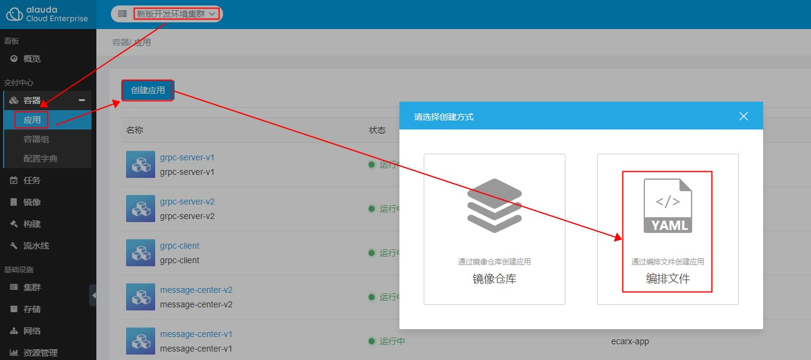
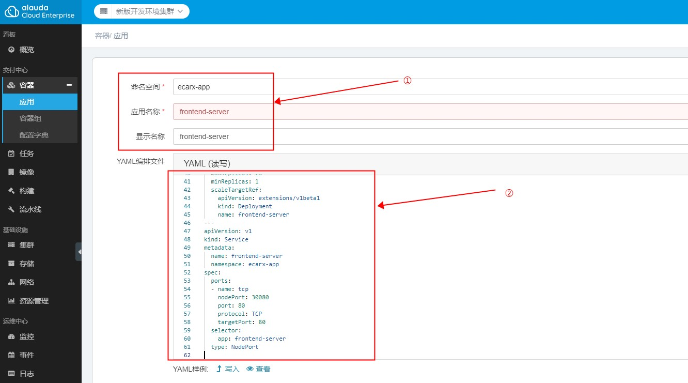
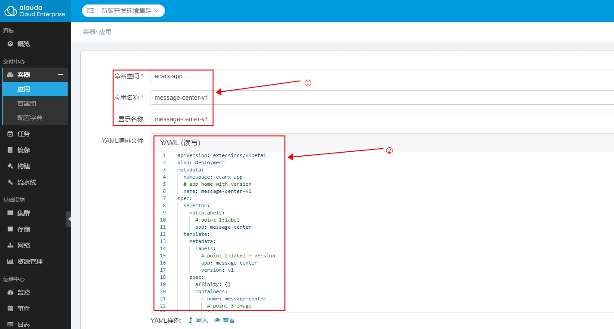

# 服务网格应用实例
>本文档就istio在实际业务环境使用做出说明，主要涉及两点：
>1. 应用部署
>2. 流量管理   

>不同的应用使用不同的模式，如：
>1. 单版本：fronted-server（tcp）服务、gRPC-client（gRPC）服务；
>2. 多版本按比重（1:9）划分流量提供服务：message-center（http）服务；
>3. 多版本指定其中一个版本提供服务：gRPC-server（gRPC）服务；

## 应用示例
- http示例项目地址：<http://api.dev.xchanger.cn/api/protected/apollo/>  
**说明：** api.dev.xchanger.cn 该域名没有添加DNS解析，自行添加解析记录至本机hosts文件，记录值为：10.160.11.92，且只支持公司内网访问。
- gRPC示例项目地址：<http://10.160.11.93:30570/some>（只支持公司内网访问）。

### 一、部署
- 部署网关
    - 创建网关应用
    1. 在新版灵雀云控制台创建应用，选择“编排文件”的方式，如图：
    2. 填写命名空间、应用名称、显示名称（可选）、填充YAML编排文件，编排文件参见：frontend-server/frontend-server.yaml
    - 创建流控规则：  
    使用kubectl连接k8s集群，使用YAML编排文件创建流控规则，编排文件参见：frontend-server/drvs-frontend-server.yaml，如图：

- 部署http应用
    - 创建应用：message-center（版本：v1、v2  ）
    1. 在新版灵雀云控制台创建应用，选择“编排文件”的方式，如图：
    2. 填写命名空间、应用名称、显示名称（可选）、填充YAML编排文件，其中v1版本的编排文件参见当前目录下的：message-center/dp-member-center-v1.yaml；v2版本的编排文件参见当前目录下的：message-center/dp-member-center-v2.yaml；如图：
    - 创建流控规则：
    使用kubectl连接k8s集群，使用YAML编排文件创建流控规则，编排文件参见：message-center/drvs-message-center-weight.yaml

- 部署gRPC应用
    - 创建应用：grpc-client
    创建过程同“部署网关”，唯一区别是编排文件。使用grpc-client的YAML编排文件即可，编排文件参见：grpc-client/dp-grpc-client-v1.yaml
    - 创建流控规则：
    创建方式同“部署网关”，唯一区别是编排文件。使用grpc-client的YAML编排文件即可，编排文件参见：grpc-client/drvs-grpc-client-v1.yaml

    - 创建应用：grpc-server
    创建过程同“部署http应用”，唯一区别是编排文件。使用grpc-server的YAML编排文件即可，编排文件参见：
        1. grpc-server/dp-grpc-server-v1.yaml
        2. grpc-server/dp-grpc-server-v2.yaml
    - 创建流控规则：
    创建方式同“部署http应用”，唯一区别是编排文件。使用grpc-server的YAML编排文件即可，编排文件参见：grpc-server/drvs-grpc-server-v1.yaml  

### 二、变配  
- 当前流控规则说明：
    - http应用（message-center）：10% ==> v1版本, 90% ==> v2版本
    - gRPC应用（grpc-server）：全部流量分配至v1版本
- 更新说明（修改对应的YAML编排文件重新应用即可）：
    - http应用（message-center）：message-center/drvs-message-center-weight.yaml
    - gRPC应用（grpc-server）：grpc-server/drvs-grpc-server-v1.yaml
